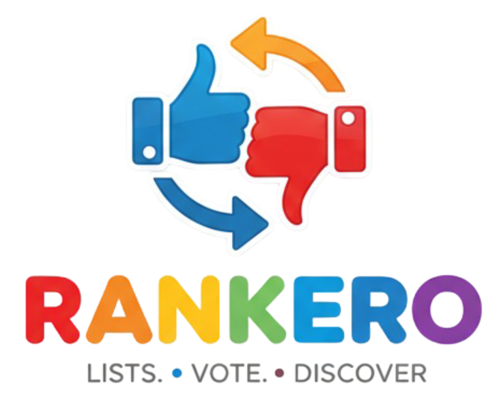
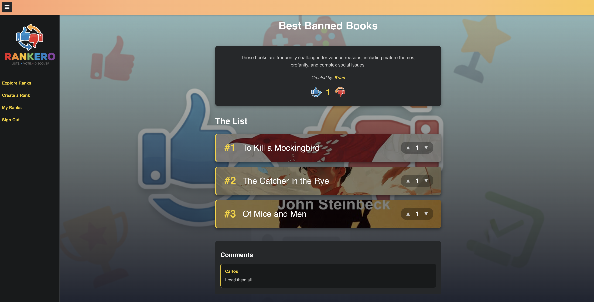

  

 

## Introduction

As someone who is indecisive and always craves to try the best stuff first, I often find myself visiting "best of" list sites or asking people close to me for their opinions. Rankero was born from this idea, aiming to provide a simple and fun platform for creating, sharing, and discovering community-driven ranked lists on any topic imaginable.

This project was built to explore modern front-end development with React, including state management with Context, client-side routing, and creating a polished, responsive user interface that communicates with a back-end API. The result is a dynamic and interactive experience with a fun incentive rating/voting system that I plan to further develop in the future.

## Key Features

- **User Authentication**: Secure sign-up, sign-in, and sign-out functionality using JWT tokens.
- **Create & Manage Ranks**: Authenticated users can create, edit, and delete their own ranked lists.
- **Interactive Voting**: Users can upvote or downvote ranks and the individual items within them.
- **Dynamic Categories**: Ranks are organized by categories, each with a unique, dynamically generated color for easy identification.
- **Commenting System**: Users can leave comments on ranks to share their opinions.
- **Responsive Design**: The application is fully responsive and provides a seamless experience on both desktop and mobile devices.
- **Real-time Search**: A debounced search bar allows users to find ranks instantly as they type.

## Getting started

### Links
- **Deployed Application**: [Rankero](https://rankeroapp.netlify.app)
- **Back-End Repository**: [Rankero API](https://github.com/JAlmonte295/Rankero_API)
- **Planning Materials**: [Trello Board](https://trello.com/b/HbZxcx5f/el-rankero-working-title-unit-3-lab-mern-stack-crud-app-project)

## Attributions 
+ The logo and other image assets used in this application were generated with the assistance of **Google's Gemini**. 

## Technologies Used 
+ **React:** A JavaScript library for building user interfaces. 
+ **React Router:** For declarative, client-side routing. +- JavaScript (ES6+): The core programming language. 
+ **CSS Modules:** For locally scoped CSS. 
+ **Vite:** A modern front-end build tool that provides a faster and leaner development experience.

## Future Improvements
+ **Image Uploads:** Allow users to upload their own images for rank choices instead of providing URLs. 
+ **User Profile Pictures:** Add the ability for users to upload and manage their own profile pictures. 
+ **Drag-and-Drop Reordering:** Enhance the Rank Form with drag-and-drop functionality for reordering list items. 
+ **Advanced Pagination:** Improve the pagination on search and category pages with features like "load more" or page number navigation.
+ **Enhanced Commenting System:** Implement features like threaded replies, editing, and deleting comments.
+ **Add competitive elements:** such as badges or leaderboards to encourage user engagement.
